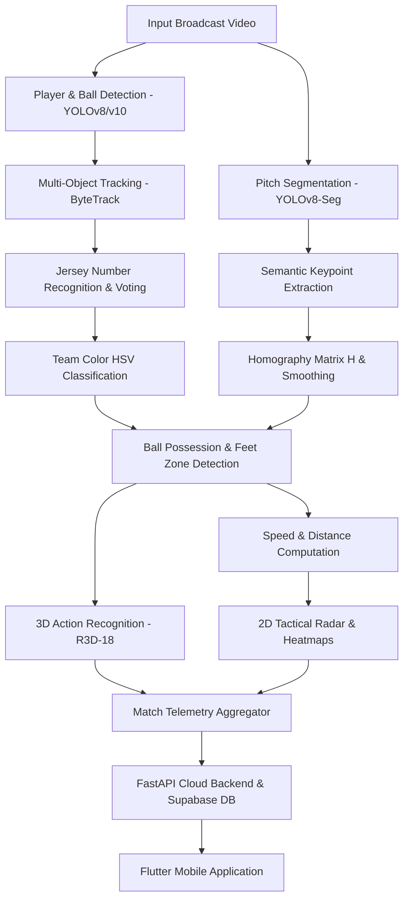

# ⚽ OFFSIDE — AI-Based Football Match Analysis System

[](https://www.python.org/)
[](https://pytorch.org/)
[](https://github.com/ultralytics/ultralytics)
[](https://fastapi.tiangolo.com/)
[](https://flutter.dev/)
[](https://supabase.com/)
[](LICENSE)

An end-to-end **Computer Vision and Deep Learning** platform designed for automated football match analysis. The system processes raw broadcast video streams to track players and the ball, classify teams, recognize jersey numbers, calculate real-time player speeds and distances, estimate camera motion to project player positions onto a **2D tactical radar**, generate **heatmaps**, and detect key match actions using 3D deep learning models.

---

## 🎥 Demo & Presentation

Watch the live demonstration and video walkthrough of the project in action:

👉 **[▶️ Watch Demo Video & Presentation on Google Drive](https://drive.google.com/file/d/1UfF7kqLUYBEW814Vvw4drPUOXV1CYPPL/view?usp=drive_link)**

---

## 🌟 Key Features

- 🎯 **Player & Ball Detection (`YOLOv8` / `YOLOv10`)**: High-precision detection of players, referees, and the ball across dynamic broadcast footage.
- 🔄 **Multi-Object Tracking (`ByteTrack`)**: Robust entity tracking maintaining consistent player IDs across consecutive frames.
- 👕 **Jersey Number Voting & Team Color Classification**: HSV color-space clustering for automated team separation, combined with OCR-based jersey number recognition and majority voting to eliminate tracking flicker.
- 📐 **Semantic Pitch Mapping & Camera Compensation**: Stadium pitch segmentation (`YOLOv8-Seg`) paired with dynamic Homography matrix estimation ($H$) and Exponential Smoothing ($\alpha = 0.15$) to compensate for camera pan, tilt, and zoom.
- 🗺️ **2D Tactical Radar & Player Heatmaps**: Real-time transformation of image screen coordinates into real-world stadium metric coordinates, producing 2D top-down tactical radar projections and spatial heatmaps.
- 🏃 **Real-Time Speed & Distance Metrics**: Continuous computation of player instantaneous speed ($m/s, km/h$) and total distance covered throughout the match.
- 🎬 **3D Action Recognition (`R3D-18`)**: 3D Convolutional Neural Network processing spatio-temporal video snippets around the ball possessor to recognize passing, shooting, and dribbling events.
- ☁️ **FastAPI & Supabase Backend**: Scalable RESTful API providing database persistence, JWT security, match stat aggregation, and cloud storage integration.
- 📱 **Cross-Platform Mobile App (`Flutter`)**: Sleek mobile interface empowering coaches, analysts, and fans to inspect player dashboards, heatmaps, team comparisons, and match highlights.

---

## 🏗️ System Architecture



---

## 📁 Repository Structure

```text
Offside-Graduation-Project/
├── AI Models/                   # Computer Vision & Deep Learning Engine
│   ├── src/                     # Core algorithmic modules
│   │   ├── detectors/           # Player detector, team classifier, action recognizer
│   │   ├── trackers/            # Ball tracker, semantic mapper, radar & speed trackers
│   │   ├── config.py            # Global pipeline configuration & thresholds
│   │   └── visualizer.py        # Video frame overlay & rendering engines
│   ├── notebooks/               # Jupyter notebooks for model training & benchmarking
│   ├── data/                    # Pitch templates & player databases
│   └── pipeline.py              # Main execution script for video processing
│
├── Backend/                     # REST API & Database Services
│   ├── main.py                  # FastAPI server routes, endpoints & Supabase queries
│   ├── requirements.txt         # Python dependencies for backend API
│   └── Dockerfile               # Containerization script for cloud deployment
│
└── mobile_app/                  # Flutter Mobile Client Application
    ├── lib/                     # Dart source code (UI screens, models, controllers)
    ├── pubspec.yaml             # Flutter package manager configuration
    └── assets/                  # Graphics, icons, and custom typography
```

---

## 🚀 Getting Started

### Prerequisites

- **Python 3.10+** installed
- **CUDA-capable GPU** (recommended for real-time video processing & PyTorch inference)
- **Flutter SDK** (v3.19.0 or higher) for mobile app compilation
- **Node.js / Docker** (optional, for backend container deployment)

---

### 1. Setting Up the AI Models & Processing Pipeline

```bash
# Navigate to the AI Models directory
cd "AI Models"

# Create a virtual environment
python -m venv venv

# Activate virtual environment
# Windows:
venv\Scripts\activate
# Linux/macOS:
source venv/bin/activate

# Install dependencies (OpenCV, PyTorch, Ultralytics, ByteTrack, etc.)
pip install -r requirements.txt

# Run the complete analysis pipeline on a sample video
python pipeline.py --input path/to/match_video.mp4 --output outputs/analyzed_match.mp4
```

---

### 2. Setting Up the FastAPI Backend

```bash
# Navigate to the Backend directory
cd Backend

# Install backend dependencies
pip install -r requirements.txt

# Configure Environment Variables (Create a .env file)
# SUPABASE_URL=your_supabase_url
# SUPABASE_KEY=your_supabase_anon_key

# Launch the FastAPI local server
uvicorn main:app --reload --host 0.0.0.0 --port 8000
```
> Access interactive API documentation at `http://localhost:8000/docs`.

---

### 3. Setting Up the Flutter Mobile Application

```bash
# Navigate to the Mobile App directory
cd mobile_app

# Fetch Dart dependencies
flutter pub get

# Run the application (Desktop / Emulator / Connected Device)
flutter run
```

---

## 🛠️ Tech Stack & Frameworks

| Layer | Technologies Used |
| :--- | :--- |
| **Computer Vision** | OpenCV, Ultralytics YOLOv8 / YOLOv10, YOLOv8-Seg, ByteTrack |
| **Deep Learning** | PyTorch, torchvision (R3D-18 3D-CNN), CUDA |
| **Backend API** | Python, FastAPI, Uvicorn, Pydantic, HTTPX |
| **Database & Cloud** | Supabase (PostgreSQL), Supabase Storage |
| **Mobile App** | Flutter, Dart, Hive, Supabase Flutter SDK |
| **Deployment** | Docker, Google Colab (Training) |

---

## 👥 Graduation Project Team

| # | Name | 
| :-: | :--- 
| 1 | **Abdelrahman Mohammed** | 
| 2 | **Salah Eldin Mostafa** |
| 3 | **Fares Mohammed** |
| 4 | **Nabil Amir** |
| 5 | **Marwa Mohammed** | 
| 6 | **Asmaa Magdy** | 

---

## 📄 License & Acknowledgments

This project is licensed under the **MIT License** — see the [LICENSE](LICENSE) file for details.  
Special thanks to our project supervisors, academic faculty, and open-source communities behind Ultralytics, PyTorch, FastAPI, and Flutter.
